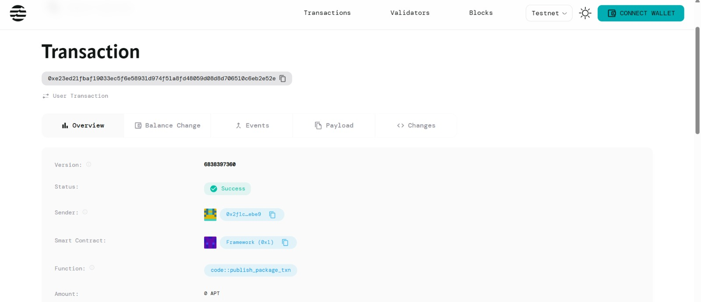

# MoodMap — Instant Mood Mapping on Aptos

> A lightweight, event‑ready mood tracking DApp powered by the Aptos blockchain (Move) with a slick React frontend and realtime visualizations.

---

## Project Title

*MoodMap: On‑Chain Mood Tracker for Events & Teams*

---

## Project Description

MoodMap lets participants share how they feel in the moment with a single click. Each submission stores a short message and mood on the Aptos blockchain using a Move smart contract. The React frontend offers a one‑tap UX and renders aggregate sentiment as *bar* or *pie* charts for instant displays during hackathons, meetups, company all‑hands, or classrooms.

---

## Project Vision

* *Make sentiment visible in seconds*: Turn a room’s vibe into live charts everyone can see.
* *Trust the data*: Store each mood event immutably on Aptos for transparency and auditability.
* *Simple enough for non‑crypto users*: One button, one message, visible results.
* *Reusable at any scale*: From a 10‑person stand‑up to a 1000‑attendee conference.

---

## Key Features

* *One‑Click Capture*: A React button triggers a transaction that stores { mood, message, sender, timestamp } on‑chain.
* *Instant Visuals: Aggregate data into **bar* or *pie* charts (e.g., Happy / Meh / Sad) with live refresh.
* *Event Codes / Namespaces*: Separate datasets per event, team, or time window (e.g., Hackathon-2025-Day1).
* *Wallet Support*: Works with popular Aptos wallets (e.g., Petra) and the Aptos TypeScript SDK.
* *Public Read APIs*: Anyone can read aggregate counts; writes require a wallet.
* *Low‑Friction Setup*: Deploy once, reuse across events by changing the event label.

---

## FutureScope

* *Advanced Analytics*: Trendlines over time, participation rate, top keywords, word cloud.
* *Role‑Based Views*: Organizer dashboard vs. public display mode.
* *Moderation & Filters*: Profanity filter, message length limits, or allow anonymous-only.
* *Off‑chain Indexer*: Cache and paginate large datasets, export CSV.
* *Mobile Display Mode*: Kiosk screens / smart TV dashboard with auto-rotate charts.
* *NFT Souvenirs*: Optional POAP-style NFT mint per participant.
* *Privacy Modes*: Hash or encrypt messages while keeping mood counts public.

---

## Contract Details
0x2f1c1fd6bfee09912c4f59306c98f3a23dfd555cb637c5c297a86b9e9c78ebe9
